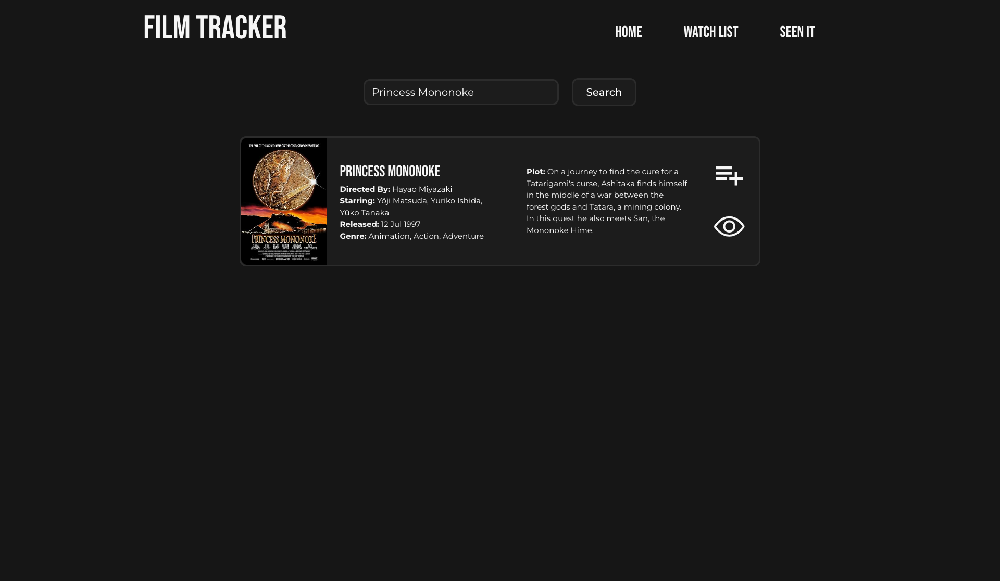
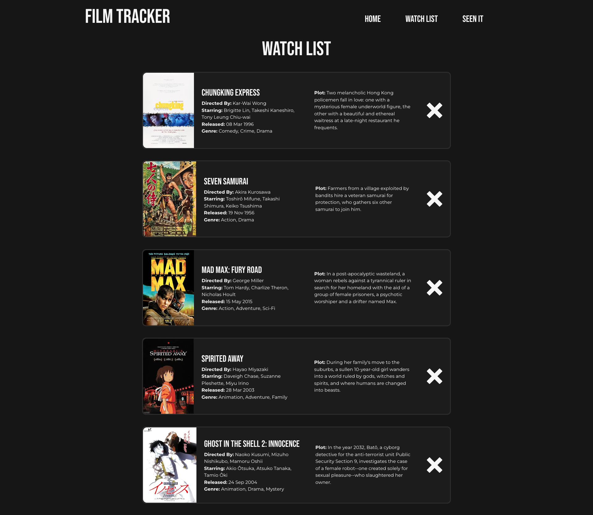
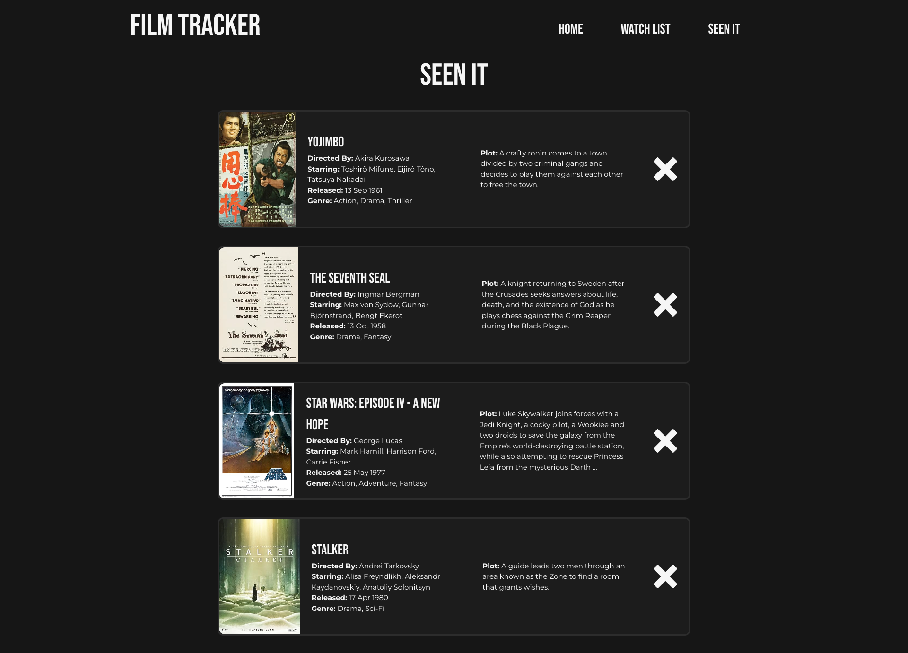

# Film Tracker

## Project Overview

The Film Tracker is a React-based application that allows users to search for films using the OMDb API and organize them into two lists: "Seen It" and "Watch." The application provides a streamlined way for film enthusiasts to keep track of movies they have watched and those they plan to watch.

Users can search for a film title, retrieve detailed information about the film, and add it to either their "Seen It" or "Watch" lists. These lists are stored in `localStorage`, ensuring that the data persists even after refreshing the page. Additionally, users can remove films from either list when they are no longer relevant.

The project is built using TypeScript and React, incorporating TypeScript interfaces to ensure type safety when handling film data from the OMDb API. The application is deployed on Render, making it accessible online.

This project provides hands-on experience in working with APIs, managing state in React, handling localStorage, and deploying applications using Render.

## Table of Contents

- [Usage](#usage)
- [Mock-Up](#mock-up)
- [Instructions](#instructions)
- [Key Features](#key-features)
- [Technology Stack](#technology-stack)
- [Additional Resources](#additional-resources)

## Usage

To run the application locally, follow these steps:

1. Clone the repository:
```bash
git clone git@github.com:gilmerperez/film-tracker.git
cd film-tracker
```

2. Install dependencies:
```bash
npm install
```

3. Create a `.env` file in the environment folder based on `.env.EXAMPLE` and add your OMDb API key:
```bash
VITE_OMDB_API_KEY=<your_api_key_here>
```

4. Start the development server:
```bash
npm run dev
```

5. Open the application in your browser at http://localhost:5173/.

## Mock-Up

The following images show the appearance and functionality of the web application:







## Instructions

### 1. **Search for a Film:**
- Enter a movie title in the search bar and click the search button.

### 2. **View Film Details:**
- The application will display relevant details about the film, including the title, year, and poster.

### 3. **Add Films to Lists:**
- Click the "Seen It" button to save a film to your watched list.
- Click the "Watch" button to save a film to your watchlist.

### 4. **Manage Lists:**
- Navigate to the "Seen It" or "Watch" list pages to view saved movies.
- Click the remove ("x") button to delete a film from either list.

### 5. **Persistent Storage:**
- Your lists are saved in localStorage, so they will remain even after refreshing the page.

### 6. **Deploy on Render:**
- The application is hosted on Render for easy access online.

## Key Features

* **Easy Removal:** Remove movies from lists with a single click.
* **Search Functionality:** Retrieve movie details from the OMDb API.
* **Dynamic Film Lists:** Organize films into "Seen It" and "Watch" lists.
* **LocalStorage Integration:** Save and retrieve movies from localStorage.
* **Render Deployment:** Access the app online without needing a local setup.

## Technology Stack

This project relies on the following tools and technologies:
* **React:** Builds the UI and manages state.
* **Render:** Hosts and deploys the application online.
* **OMDb API:** Fetches movie data based on user search queries.
* **TypeScript:** Ensures type safety and better code organization.
* **Vite:** Fast development server and build tool for React projects.
* **LocalStorage:** Saves and retrieves user-selected movies persistently.
* **React Icons:** Provides icons for UI elements like the remove ("x") button.

## Additional Resources

Learn more about the [OMDb API](https://www.omdbapi.com/)

Read the [React Icons documentation](https://react-icons.github.io/react-icons/)

Guide on [Deploying React Apps on Render](https://coding-boot-camp.github.io/full-stack/render/render-deployment-guide)

Official [Render Documentation on Environment Variables](https://docs.render.com/configure-environment-variables)
